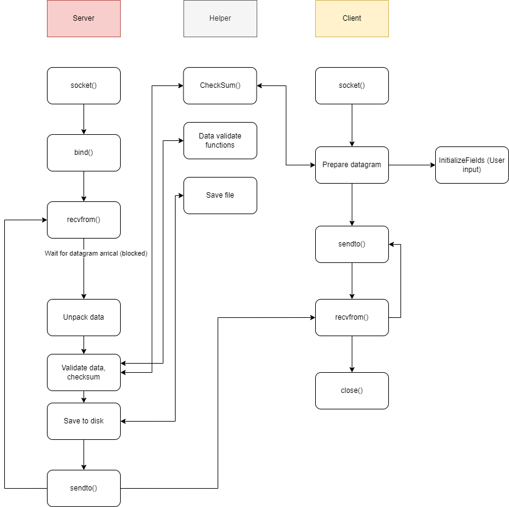

# UDP Messaging Application
Author:  Thomas Nguyen

### 1. Requirements
- [x] Receives flight information via UDP .
- [x] Unpacks flight information from the UDP datagram.
- [x] Saves the flight information to disk.
### 2. Assumption
- Assume there is only 1 correct payload version (version 1)
- Destination code is a simple 3 character string, for simplification purpose
- Only 1 client and 1 server can connect at a time
- Error checking and optimization is not important, and not the main focus of this application
### 3. Decision

- A client program implementation is needed for ease of testing and future development
- Raw socket vs datagram socket & serialization vs string\
My original plan was to create a custom header using raw socket, then pack the message through serialization. However, this idea was complicated, time-consuming and presented a lot of bugs. To make things simpler, I put all data in the data segment of an UDP message (as structs), and send it through datagram socket as message string.
- Checksum function\
The checksum function, if implemented correctly, would be very complicated, and would include alot of bit manipulation. To keep thing simple, I created a custom checksum function that simply assign a pointer with the fields data type of the struct, and just calculate the sum of bytes within it
- The library I used are standard, so there isn't any need to install external library

### 4. Application block diagram
\
### 5. File structure
All files are presented as it is, there is only 1 image folder for the markdown file.
### 6. Instructions
- Run `make clean` to clean all residue files
- Run `make` to compile
- Open 2 different terminals
- Run `./server` on 1 and `./client` on the other
- In **client** terminal, input values as instructed, you can either choose the default message (Y) or input it yourself (N)
- After entering information, related information and confirmation will be printed on both the **server** and **client** terminals.
- The **client** will exit after successful package transmission. Simply start another instance of it, or press `Ctrl+C` on **server** terminal to close the program.

>Reset wsl2 or linux instance if there are undefined errors (which shouldn't happen)

*Thanks for reading* :joy: